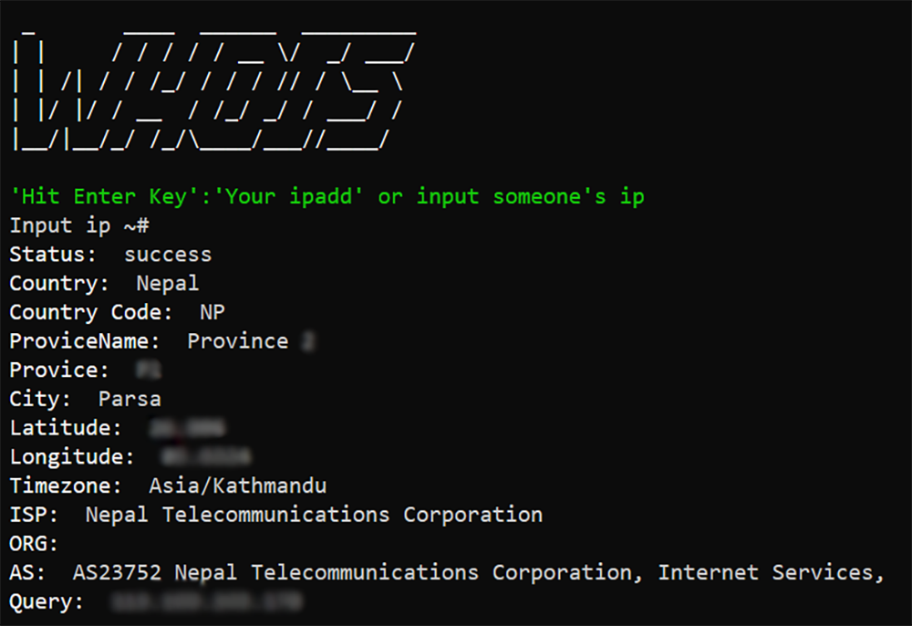
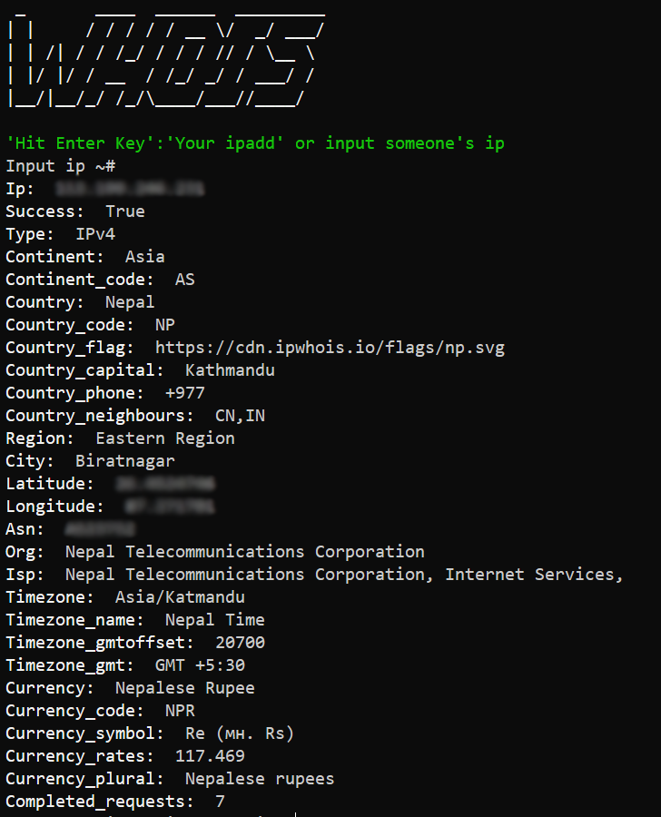

# What is the identity of the person behind an IP address?
## Find information about an IP address, such as its location, ISP, hostname, region, country, and city. An IP address can be traced, tracked, and located.


## How to run :
```bash
  git clone https://github.com/ASACHIT/ip_lookup.git
  cd ip_lookup
  python3 ip-look.py
  #or
  python3 ip-lookup-geo.py #for more detail.
```
    
## Screenshot
### ip-lookup.py


### ip-lookup-geo.py



  